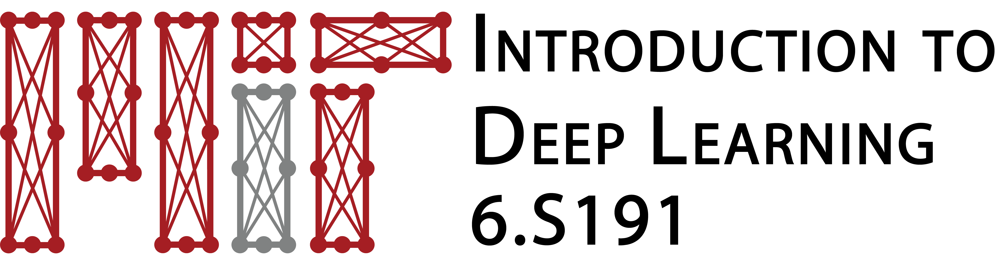
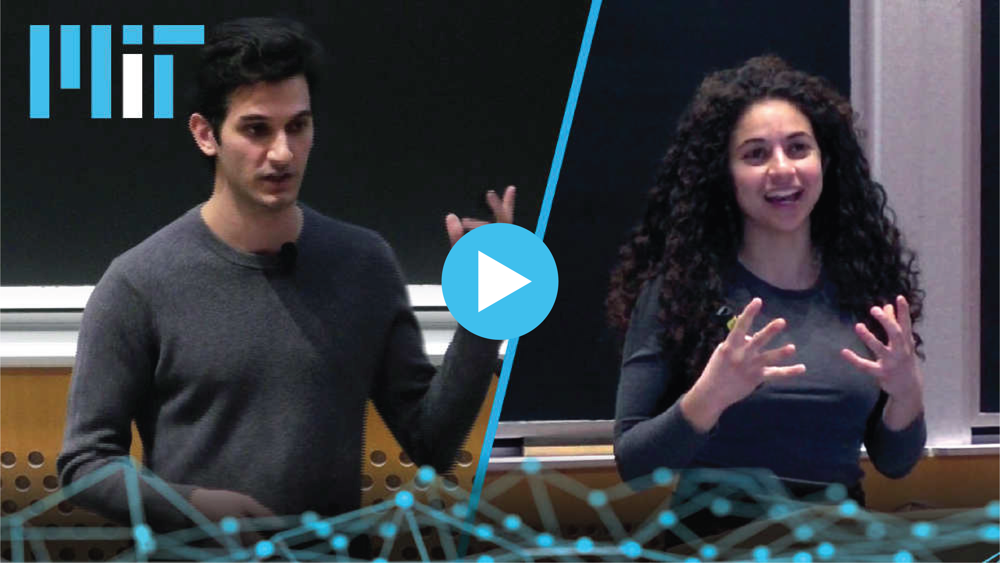

This repository contains all of the code and software labs for [MIT Introduction to Deep Learning](http://introtodeeplearning.com)! All lecture slides and videos are available on the program website.

# Instructions
MIT Introduction to Deep Learning software labs are designed to be completed at your own pace. At the end of each of the labs, there will be instructions on how you can submit your materials as part of the lab competitions. These instructions include what information must be submitted and in what format.

## Opening the labs in Google Colaboratory:

The 2023 Introduction to Deep Learning labs will be run in Google's Colaboratory, a Jupyter notebook environment that runs entirely in the cloud, so you don't need to download anything. To run these labs, you must have a Google account.

On this Github repo, navigate to the lab folder you want to run (`lab1`, `lab2`, `lab3`) and open the appropriate python notebook (\*.ipynb). Click the "Run in Colab" link on the top of the lab. That's it!

## Running the labs
Now, to run the labs, open the Jupyter notebook on Colab. Navigate to the "Runtime" tab --> "Change runtime type". In the pop-up window, under "Runtime type" select "Python 3", and under "Hardware accelerator" select "GPU". Go through the notebooks and fill in the `#TODO` cells to get the code to compile for yourself!

### MIT Deep Learning package
You might notice that inside the labs we install the `mitdeeplearning` python package from the Python Package repository:

`pip install mitdeeplearning`

This package contains convienence functions that we use throughout the course and can be imported like any other Python package.

`>>> import mitdeeplearning as mdl`

We do this for you in each of the labs, but the package is also open source under the same license so you can also use it outside the class.

## Lecture Videos

All lecture videos are available publicly online and linked above! Use and/or modification of lecture slides outside of MIT Introduction to Deep Learning must reference:

> © MIT Introduction to Deep Learning
>
> http://introtodeeplearning.com

## License
All code in this repository is copyright 2023 [MIT Introduction to Deep Learning](http://introtodeeplearning.com). All Rights Reserved.

Licensed under the MIT License. You may not use this file except in compliance with the License. Use and/or modification of this code outside of MIT Introduction to Deep Learning must reference:

> © MIT Introduction to Deep Learning
>
> http://introtodeeplearning.com
